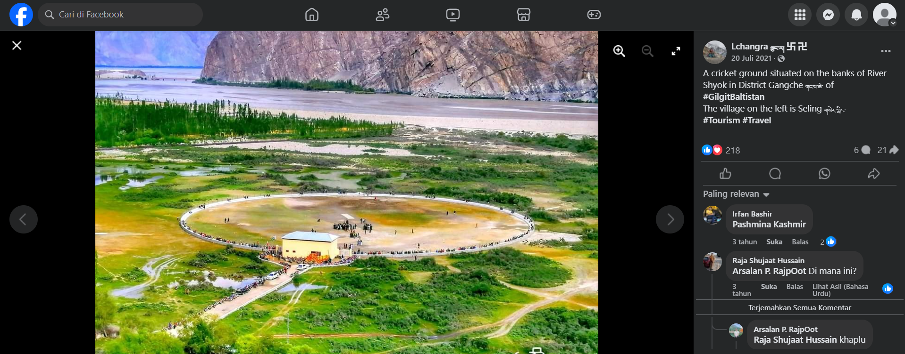
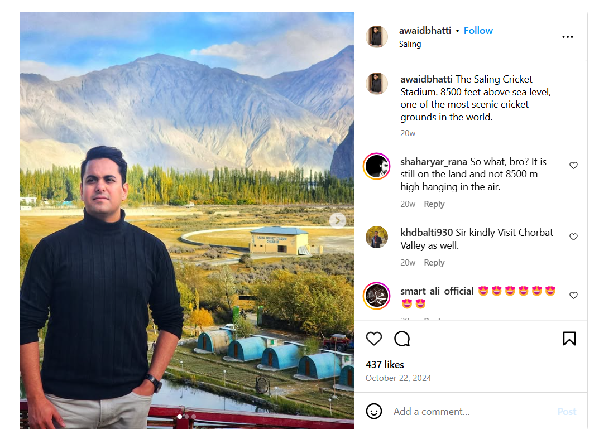

### 

## Description

My friend wanted to play a cricket match, he told me to find the best place to play a game. So I did. Can you identify the stadium where we played our match?

## Attachments

## Points

200

## Solving Steps

### Step 1 (Using Google Lens)

After being given a photo of a stadium's location, the first thing you want to do is Google Lens it and start from there. Through this Google Lens search, I was able to get a <a href="https://web.facebook.com/Lchangra/photos/a.768347663215532/4384178328299096/?type=3&from_lookaside=1&_rdc=1&_rdr#">facebook post</a> of the same stadium but more zoomed in. In this facebook post, I saw a comment from 3 years ago asking where the stadium is. Someone responded that it is in Khaplu.
 

 

### Step 2 (Finding the stadium in Khaplu)

I searched up Khaplu Cricket Stadium and the first thing that popped up was an <a href="https://www.instagram.com/awaidbhatti/p/DBbSojPI5VE/?img_index=1">Instagram post</a>. The description of the post says that the stadium's name is <b>The Saling Cricket Stadium</b>. You can even see the name of the stadium on the post.
 

 

After trying to redeem the flag a few times, I got the correct flag format which is the full name of the cricket stadium:  <b>Vishwa{Saling_Cricket_Stadium_Ghanche}</b>

