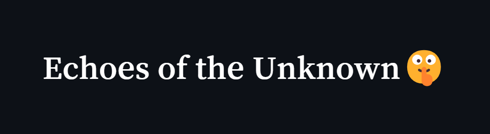
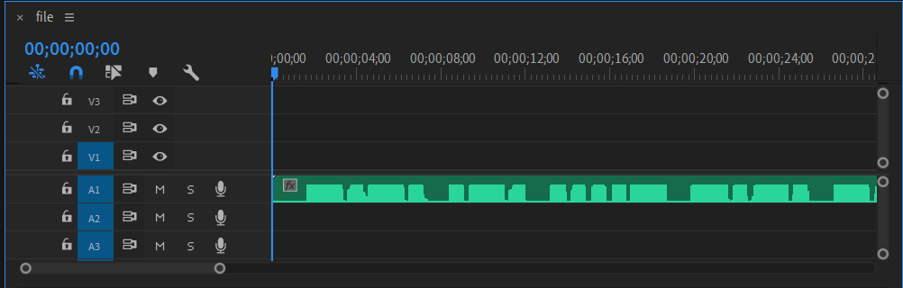
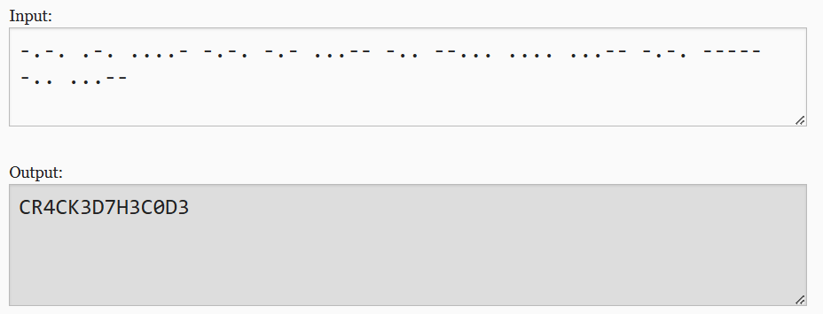

# 

## Description

Not everything is heard—some things must be seen.

## Points

100

## Solving Steps

There is supposed to be a wav file but I couldn't upload it to github. But anyways, after reading the the description I immidietly knew this was going to be morse code. So I opened up the file in Adobe Premiere Pro (don't judge, I don't have any other audio opening softwares). Zooming into the wav file, you'll see that it looks like morse code.
 

 

So I replicated the morse code structure into a <a href="https://morsecode.world/international/translator.html">morse code translator</a> and sure enough, it was the flag.
 

 

<b>Vishwa{CR4CK3D_7H3_C0D3}</b>
