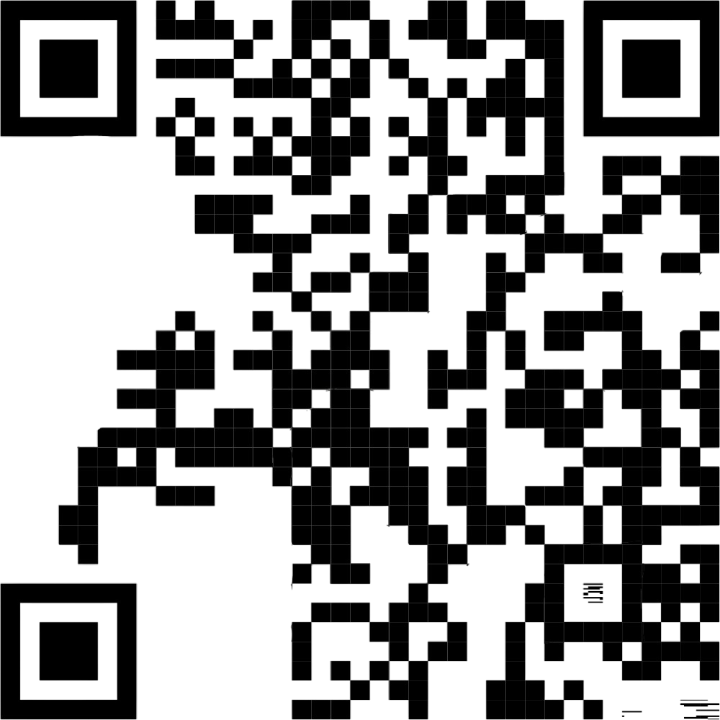
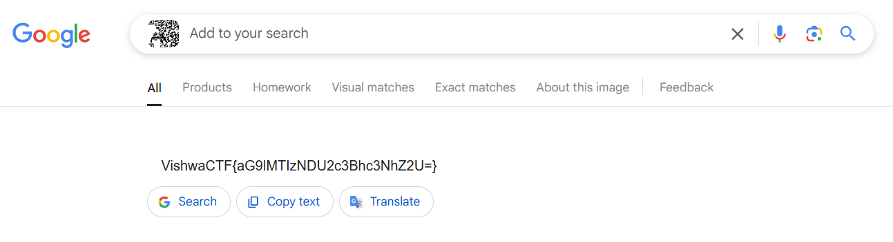

# 

## Description

Four pieces of a forgotten code lie before you. Each fragment holds a part of a greater whole, but the puzzle is incomplete. Your task: find the pattern, align the pieces, and unlock the final code. Once the pieces fall into place, scan what you’ve created to uncover the secret within.  

Let the search begin.

## Attachments

[Zip file containing the QR code pieces](additional-files/QuadRant.zip)

## Points

100

## Solving Steps

When you open the ZIP file and combine all the pices, you might realize that a big chunk of the QR code is missing. But in some QR codes, it can still detect up to a certain percentage of errors. This QR code is one of them.
 

 

Now for some reason, it doesn't work when I try to scan the QR code with my phone. Then I had the bright idea to put it in Google Lens.
 

 

<b>VishwaCTF{aG9lMTIzNDU2c3Bhc3NhZ2U=}</b>
